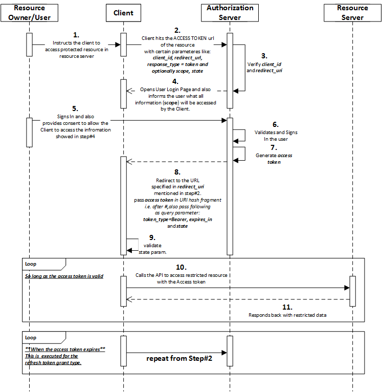
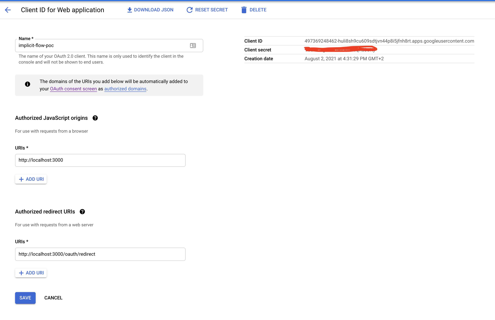

# OAuth 2.0

## What is OAuth?

It’s an open standard for authorisation and anyone can implement it.

More specifically, it is a standard that apps can use to provide client applications with “secure delegated access”. It works over HTTPS and authorises devices, APIs, servers, and applications with access tokens rather than credentials.

An Access Token is a piece of data that represents the authorisation to access resources on behalf of the end-user.

Feel free to read more about the standard [here](https://datatracker.ietf.org/doc/html/rfc6749).

## Why OAuth?

The era of stand-alone web applications is long gone. Today, web and mobile applications are decomposed into various smaller components and many of these components are interconnected. Just think about the variety of APIs and services that modern applications use.

They use APIs to fetch information about the user or to perform operations on behalf of the user's name. In turn, many applications expose an API that other applications can use. This interconnected world of applications and APIs raises a lot of questions:
- How can the user allow an application to access a service on their behalf?
- Does the user need to share their credentials to give another application access?
- And what if the user wants to revoke access later on?

These questions expose hard challenges faced by developers in the current application landscape. Fortunately, many of these challenges are addressed by OAuth 2.0. With OAuth 2.0, a user can allow an application to access an API on their behalf without having to share their credentials.

### Valet Key Analogy

Many cars come with a special valet key. Just like the regular key of the car, the valet key can be used to open the door and start the car. But the valet key cannot be used to open the glove compartment or the trunk.

A valet key is quite useful when you need to hand over your car to a parking attendant. With the valet key, the attendant can access and park the car. At the same time, you can leave personal belongings in the glove compartment or trunk, knowing that they cannot be accessed with the valet key.

In a way, the valet key can be seen as an **access token** with limited permissions. The car owner uses the valet key to **delegate access** to a parking attendant. Because of the properties of the valet key, the owner can delegate access to some of the car features, while preventing access to others.

## Terminology

One of the confusing aspects of OAuth 2.0 is its terminology. For example, terms like "client" mean something different to us as web developers. To avoid any such confusion going forward, let's first establish the terminologies.

### Protected Resource

OAuth 2.0 is all about delegating access to applications on the user's behalf. Whether the user is delegating access to data, operations, or something else does not matter. All of these items are referred to as a protected resource. For example, an application may wish to access a user's Google profile through one of the Google provided APIs. Such an API is a protected resource.

### Resource Server

These protected resources are hosted on a resource server. The resource server is responsible for verifying which client is accessing the API and whether the client is authorised to do so.

### Client

Protected resources are accessed by a **client**. Here the term client merely refers to an entity wanting to access a protected resource. It does not imply that this needs to be a client-side application. Clients can be mobile applications, web frontends, web backends, or even system services. These all fulfill the client role in an OAuth 2.0 architecture.

### Resource Owner

Somebody needs to grant the client access to a protected resource. This role is fulfilled by the resource owner. The user is the owner of the data and timeline exposed by the API. Therefore, the user is responsible for granting a client access to these resources.

### Auth Server

There is one last piece missing: a mechanism to delegate access to a protected resource to a client. OAuth 2.0 facilitates such delegation by introducing an **authorisation server**. The authorisation server has several jobs: authenticating both the client and the user, and determining whether the client is allowed to access the requested protected resources. The authorisation server will issue an access token to the client. The client uses this **access token** to contact the resource server to access protected resources.

**Note**: The authorisation server belongs to the same organization that also controls the protected resources. The client, however, can be built by an independent third party.

## Grant Types

In OAuth 2.0, grants are the set of steps a client has to perform to get resource access authorisation. The authorisation framework provides several grant types to address different scenarios.

1. Implicit Grant
2. Authorisation Code Grant
3. Resource Owner Password Credentials Grant (ROPC)
4. Client Credentials Grant
5. Authorisation Code Grant with Proof Key for Code Exchange (PKCE)

These grant types are explained in detail below.

## Implicit Grant

This flow is considered insecure even though the OAuth flow itself is secure. It is because all interactions happen within the browser which is considered as an insecure environment.

The access token is attached has a hash fragment on the browser which means that it then lives in the browser history. Also, there is no concept of refresh token in this flow i.e once the access token expires, client will have to go through all of the above steps to receive a new access token.

Because of such limitations this flow is now deprecated and not recommended to be used for any new applications. However, it is still good to be aware of how it works which is why we will go through it in detail.

The implicit grant is(was) optimized for pure web applications. It is intended for use only by public clients such as a frontend application. The result of the implicit grant is an access token which grants access to a protected resource.

Flow of control is run entirely in the browser with use of redirects:

1. **Client** reaches out to the **authorisation server** asking for an **access token**. This is done by redirecting the browser to an authorise endpoint provided by the authorisation server.
2. Authorisation server asks the **user** to authenticate itself(if unauthenticated). If the user is already authenticated, the auth server redirects the user back to the client. See step 5.
3. User authenticates itself by providing credentials. Authorisation server then asks the user to grant authorisation to client to access the requested resources depending on the scope of initial request. As an example, you must have seen a similar authorsation reqeust from Google or Facebook suggesting that the client app is requesting information to access your contacts, photos etc.
4. User authorises the client application.
5. Auth server redirects back to the client app using the Redirect URL specified in initial request in step 1 by attaching access token in the hash fragment.
6. Client app upon receiving the access token can now access the protected resources provided the scope of access token allows access to them.

A pictorial representation of the above flow can be seen below.

## Authorisation Code Flow

The authorisation code grant is optimized for delegating access to clients which are capable of securely storing secrets. Examples are server-side applications or native client-side applications.

Flow of control for this flow works like below:

1. **Client** reaches out to the **authorisation server** asking for an **access token**. This is done by redirecting the browser to an authorise endpoint provided by the authorisation server.
2. Authorisation server asks the **user** to authenticate itself(if unauthneticated). If the user is already authenticated, the auth server redirects the user back to the client. See step 5.
3. User authenticates itself by providing its credentials. Authorisation server then asks the user to grant authorisation to client to access the requested resources.
4. User authorises the client application.
5. Auth server redirects back to the client app using the Redirect URL specified in initial request in step 1 by attaching **authorisation code** as a query parameter.
6. The server-side client contacts the authorisation server through a back-door channel to exchange the authorisation code for an access token. This step requires client authentication, using the client ID and client secret.
7. App upon receiving the access token can now access the protected resources provided the scope of access token allows access to them.

The authorisation code flow never exposes an access token to a public part of the application. Instead, it uses a one-time-use-only authorisation code. This code can only be exchanged in combination with the client ID and the associated client secret.

Because of these strict requirements, the authorisation code flow is well-suited to obtain long-term access to a protected resource. To enable such behavior, the authorisation server can choose to issue a long-lived refresh token along with the access token. As long as the refresh token is valid, it can be used to obtain a fresh access token.

A pictorial representation of the above flow can be seen below.

## Resource Owner Password Credentials Grant Flow

With this flow, the client requests credentials from the user and uses them to authenticate with the authorisation server.

This flow exposes the user's credentials directly to the client, allowing the client to access the service as the user. Strictly speaking, this flow is less about delegation and more about **impersonation**.

Since exposing the credentials to the client poses a significant security risk, this flow should be used only in a few select cases.

## Client Credentials Grant Flow

This flow is quite straightforward. Client contacts the authorisation server directly and provides the client ID and client secret and the auth server responds with an access token Client uses this token to access client-specific protected resources. An example is an API offering information about the registered client.

This flow is quite common, albeit invisible to the end user. One example is server-to-server authentication, either between internal services or between third-party services. The most important security consideration to keep in mind is that the client credentials flow requires access to the client ID and client secret. Therefore, it should only be executed by a confidential client.

## Authorisation Code Flow with Proof Key for Code Exchange (PKCE)

This flow was designed to be used for pure client-side apps which were earlier relying on the Implicit Flow. It comes with its own specification and enables apps to use the most secure of the OAuth 2.0 flows - the authorisation Code flow - in public or untrusted clients.

It accomplishes this by doing some setup work before the flow and some verification at the end of the flow to effectively utilize a dynamically-generated secret. This is crucial since it’s not safe to have a fixed secret in a public client (like a SPA app in your browser).

PKCE was originally created for mobile and native applications because, at the time, both browsers and most providers were not capable of supporting PKCE. That is no longer the case.

Flow of control for this flow works like below:

1. **Client** reaches out to the **authorisation server** asking for an **access token**. This is done by redirecting the browser to an authorise endpoint provided by the authorisation server. A random value at the beginning of the flow called a **Code Verifier**. The app hashes the Code Verifier and the result is called the **Code Challenge**. This challenge is included in the query string for the request to the authorisation Server.
2. Authorisation server asks the **user** to authenticate itself(if unauthneticated). If the user is already authenticated, the auth server redirects the user back to the client. See step 5.
3. User authenticates itself by providing its credentials. Authorisation server then asks the user to grant authorisation to client to access the requested resources.
4. User authorises the client application.
5. Auth server stores the code challenge and redirects the user back to the client app using the Redirect URL specified in initial request in step 1 by attaching **authorisation code**.
6. Client then sends this code along with the code verifier generated in Step 1 to the `token` endpoint requesting for an access token.
7. Auth server then verifies the received code verifier with the code it had stored in step 5 and returns the access token upon successful match.
7. App upon receiving the access token can now access the protected resources provided the scope of access token allows access to them.

A pictorial representation of the above flow can be seen below.

## Demo

Following grant types are demonstrated using sample NodeJS applications by making use of Google's OAuth APIs.

1. Implicit Flow
2. Authorisation Code Flow

Other grant types such as ROPC and Client Credentials are not supported by Google OAuth and hence can't be captured in this demo.

Authorisation Code Flow With PKCE is also not captured as part of this demo since Google still requires a client secret to be maintained in a native app as opposed to the common standard of not storing any secrets on the client.

Each application is a standalone Node app serving at http://localhost:3000. Hence, you can only run one grant type at a time.

### Prerequisites

Any application that uses OAuth 2.0 to access Google APIs must have authorisation credentials that identify the application to Google's OAuth 2.0 server. The following steps explain how to create credentials for your project. Your applications can then use the credentials to access APIs that you have enabled for that project.

1. Go to the [Credentials page](https://console.developers.google.com/apis/credentials).
2. Click Create credentials > OAuth client ID.
3. Select the Web application application type.
4. Complete the form. Applications that use JavaScript to make authorised Google API requests must specify authorised JavaScript origins. The origins identify the domains from which your application can send requests to the OAuth 2.0 server. These origins must adhere to [Google’s validation rules](https://developers.google.com/identity/protocols/oauth2/javascript-implicit-flow#origin-validation).

Once a client credential has been successfully created in Google, you should be able to see the details of your application as below.

### Implicit Flow

We have two different pages in our app to completely demonstrate the flow i.e `login` and `redirect`.

In the login page when we try to access the user profile, we get a **401** error because there is no access token available yet and our client app is not yet authorised.

Follow the hyperlink on the page to perform an Implicit Flow authorisation with Google. Once our client app is successfully authorised, it is redirected to http://localhost:3000/oauth/redirect and the access token is attached to the hash fragment by the google auth server.

Using the available access token, we can now access the user profile.

### Authorisation Code Flow

Similar to Implicit Flow, we have two different pages in our app to demonstrate the flow i.e `login` and `landing`. We also make use of a `oauth/redirect` as a temporary step to exchange authorisation code with an access token.

In the login page when we try to access the user profile, we get a **401** error because there is no access token available yet and our client app is not yet authorised.

Follow the hyperlink on the page to perform an Implicit Flow authorisation with Google. Once our client app is successfully authorised, it is redirected to http://localhost:3000/oauth/redirect. Our Node app intercepts this requested page and makes a backend channel request with Google to exchange the authorisation code with an access token.

Once successful, it redirects the user to a `landing` page where user profile is requested through a middleware API which can attach an access token to the actual request.

## References

- https://developer.okta.com/blog/2017/06/21/what-the-heck-is-oauth#what-is-oauth
- https://datatracker.ietf.org/doc/html/rfc6749
- https://oauth.net/2/grant-types/
- https://auth0.com/docs/flows/authorisation-code-flow-with-proof-key-for-code-exchange-pkce
- https://developers.google.com/identity/protocols/oauth2/javascript-implicit-flow
- https://developers.google.com/identity/protocols/oauth2/web-server
- https://developer.okta.com/blog/2019/10/21/illustrated-guide-to-oauth-and-oidc