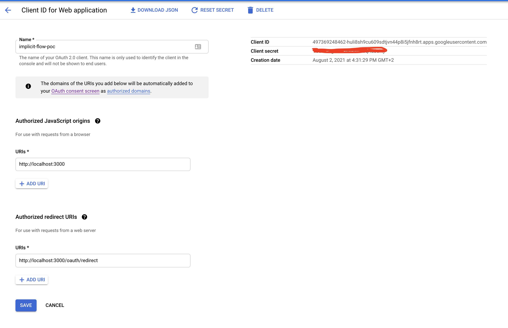

# OIDC (OpenID Connect)

## What is OIDC?

OpenID Connect(OIDC) simply put is an **identity layer** on top of the OAuth 2.0 protocol published in 2014. It enables Clients to verify the identity of the end user based on the authentication performed by an Authorisation Server, as well as to obtain basic profile information about the user in an interoperable and REST-like manner.

It implements authentication as an extension to the OAuth 2.0 authorisation process. Use of this extension is requested by Clients by including the `openid` scope value in the initial authorisation request. Information about the authentication performed is returned in a JSON Web Token (JWT) called an **ID Token**.

OAuth 2.0 Clients using OpenID Connect are also referred to as **Relying Parties (RPs)**.

## Why OIDC?

There is some confusion regarding the differences between OAuth 2.0 and OIDC due to the fact that both standards share similar terminology, grant types and does a user "authentication" before granting tokens. Let's try to clear that confusion.

We saw in the previous post that OAuth 2.0 deals with delegated access to resources. Since a user is first authenticated by the auth server, it is tempting to consider that reception of an access token of any type proves that such an authentication has occurred. However, mere possession of an access token doesn't tell the client anything on its own. In OAuth, the access token is designed to be opaque to the client, but in the context of a user authentication, the client needs to be able to derive some information from the token.

This problem stems from the fact that the client is not the intended **audience** of the OAuth access token. Instead, it is the **authorised** presenter of that token, and the **audience** is in fact the protected resource. Thus, we need an artifact/token that is directed towards the client itself. And this is where OIDC comes into picture. ID Token which is issued along with an access token is directed towards the client. It contains the basic information regarding the logged in user in a JWT format which can be decoded by the client. Thus, it knows that the user accessing the application is who they claim to be.

## Terminology

Since OIDC is an extension to OAuth 2.0, it uses a similar terminology we defined in the previous post. Hence, we will cover only OIDC specific terminology in this section.

### Claim

Piece of information asserted about an Entity.

### ID Token

This is a key feature in OIDC flow. It is a security JSON Web Token (JWT) that contains claims about the Authentication event. It MAY contain other Claims. Some of the claims within an ID Token are:

- iss: case sensitive URL of the issuer of the response
- sub: a locally unique and never reassigned identifier within the issuer for the end user which is intended to be consumed by the Client
- aud: audience(s) that this ID Token is intended for. It MUST contain the OAuth 2.0 `client_id` of the Relying Party as an audience value.
- exp: expiration time on or after which the ID Token MUST NOT be accepted for processing
- nonce: string value used to associate a Client session with an ID Token and to mitigate replay attacks.

### OpenID Provider (OP)

OAuth 2.0 Authorisation Server that is capable of Authenticating the end user and providing Claims to a Relying Party about the Authentication event and the end user.

### Relying Party (RP)

OAuth 2.0 Client application requiring end user authentication and claims from an OpenID Provider.

### Subject Identifier

Locally unique and never reassigned identifier within the Issuer for the end user, which is intended to be consumed by the Client.

### UserInfo Endpoint

This endpoint is to be provided by an OP returning some extra claims which are not a part of the ID Token.

## Grant Types

OIDC defines three flows, two of which are built upon flows defined in OAuth 2.0. These flows dictate what response types an authorisation request can request and how tokens are returned to the client application.

1. Implicit Flow
2. Authorisation Code Flow (with or without PKCE)
3. Hybrid Flow

In [OAuth 2.0](https://datatracker.ietf.org/doc/html/rfc6749#page-18), the value of `response_type` is either **code** or **token**. OpenID Connect has added a new value, **id_token**, and allowed any combination of code, token and id_token. As a result, now response_type can take any one of the following values. We will cover them later in detail.

1. code
2. token
3. id_token
4. id_token token
5. code id_token
6. code token
7. code id_token token

**Note**: A request for an ID token **must** include `openid` in the scope request parameter. Especially, if openid is not included in scope, the case of response_type=code is regarded as the original authorisation code flow defined in RFC 6749 and an ID token won't be issued. The same is true of the case of response_type=code token, too.

## Implicit Flow

This flow is built on top of the OAuth 2.0 implicit grant flow. When using the Implicit Flow, all tokens are returned from the Authorisation Endpoint; the Token Endpoint is not used.

It is mainly used by Clients implemented in a browser using a scripting language. The Access Token and ID Token are returned directly to the Client, which may expose them to the End-User and applications that have access to the End-User's User Agent. The Authorisation Server does not perform Client Authentication.

The Implicit Flow goes through the following steps.

1. Client prepares an Authentication Request containing the desired request parameters.
2. Client sends the request to the Authorisation Server.
3. Authorisation Server authenticates the End-User.
4. Authorisation Server obtains end user Consent/Authorisation.
5. Authorisation Server sends the end user back to the Client with an ID Token and, if requested, an Access Token.
6. Client validates the ID token and retrieves the end user's Subject Identifier.

## Authorisation Code Flow

This flow is built on top of the OAuth 2.0 authorisation grant flow. When using the Authorisation Code Flow, all tokens are returned from the Token Endpoint.

Similar to the flow in OAuth 2.0 it returns an Authorisation Code to the Client, which can then exchange it for an ID Token and an Access Token directly. This provides the benefit of not exposing any tokens to the User Agent and possibly other malicious applications with access to the User Agent. The Authorisation Server can also authenticate the Client before exchanging the Authorisation Code for an Access Token. The Authorisation Code flow is suitable for Clients that can securely maintain a Client Secret between themselves and the Authorisation Server.

The Authorisation Code Flow goes through the following steps.

1. Client prepares an Authentication Request containing the desired request parameters.
2. Client sends the request to the Authorisation Server.
3. Authorisation Server authenticates the end user.
4. Authorisation Server obtains end user Consent/Authorisation.
5. Authorisation Server sends the end user back to the Client with an Authorisation Code.
6. Client requests a response using the Authorisation Code at the Token Endpoint.
7. Client receives a response that contains an ID Token and Access Token in the response body.
8. Client validates the ID token and retrieves the end user's Subject Identifier.

## Hybrid Flow

The Hybrid Flow is a modified version of the Authorization Code Flow. If you take another look at the Authorization Code Flow, you can see that the client only gets the identity token after exchanging the authorization code. This implies that an additional step is needed before the user can effectively be authenticated. The Hybrid Flow offers a way to avoid this extra step to obtain the identity token.

Using the `response_type` parameter in the initial authorisation request, we can receive the ID token in the initial request itself. When that happens, the client can use the identity token to establish the user identity, before having exchanged the code for its corresponding tokens. The client still exchanges the code for the tokens but can now do that independently of user authentication.

This is the most common use of the hybrid flow. However, the flow also supports additional configurations. For example, different kind of `response_type` parameter values are supported for different use cases.

1. `id_token code`: Issues an identity token and authorisation code
2. `id_token token`: Issues an identity token and access token
3. `id_token code token`: Issues an identity token, authorisation code and access token

## response_type

As mentioned above, let's have a closer look at how different combinations of response_type parameter value affect the issuance of tokens and authorisation code

### response_type=code

**If openid is included in scope**

| Endpoint      | Authorisation Code  | Access Token | ID Token   |
| ------------- |:-------------------:| ------------:| ----------:|
| Authorisation | Issued              | X            | X          |
| Token         | X                   | Issued       | Issued     |

**If openid is not included in scope** i.e it is not an OIDC flow anymore but an authorisation code flow of OAuth 2.0

| Endpoint      | Authorisation Code  | Access Token | ID Token   |
| ------------- |:-------------------:| ------------:| ----------:|
| Authorisation | Issued              | X            | X          |
| Token         | X                   | Issued       | X          |

### response_type=token

This implies the flow is OAuth 2.0 Implicit flow regardless of whether openid is part of scope. Token endpoint is not used in this flow.

| Endpoint      | Authorisation Code  | Access Token | ID Token   |
| ------------- |:-------------------:| ------------:| ----------:|
| Authorisation | X                   | Issued       | X          |

### response_type=id_token

Only an ID token is issued from the authorisation endpoint. Token endpoint is not used.

| Endpoint      | Authorisation Code  | Access Token | ID Token   |
| ------------- |:-------------------:| ------------:| ----------:|
| Authorisation | X                   | X            | Issued     |

### response_type=id_token token

An ID token and an access token are issued from the authorization endpoint. This flow does not use the token endpoint.

| Endpoint      | Authorisation Code  | Access Token | ID Token   |
| ------------- |:-------------------:| ------------:| ----------:|
| Authorisation | X                   | Issued       | Issued     |

There are some security aspects to this response type which is not in the scope of this post. :blush:

### response_type=code id_token

An authorization code and an ID token are issued from the authorization endpoint, and an access token and an ID token are issued from the token endpoint

| Endpoint      | Authorisation Code  | Access Token | ID Token   |
| ------------- |:-------------------:| ------------:| ----------:|
| Authorisation | Issued              | X            | Issued     |
| Token         | X                   | Issued       | Issued     |

There are some security aspects to this response type which is not in the scope of this post. :blush:

### response_type=code token

An authorization code and an access token are issued from the authorization endpoint, and an access token is issued from the token endpoint. In addition, if openid is included in the scope request parameter, an ID token is issued from the token endpoint, too.

**if openid is included**

| Endpoint      | Authorisation Code  | Access Token | ID Token   |
| ------------- |:-------------------:| ------------:| ----------:|
| Authorisation | Issued              | Issued       | X          |
| Token         | X                   | Issued       | Issued     |

**if openid is not included**

| Endpoint      | Authorisation Code  | Access Token | ID Token   |
| ------------- |:-------------------:| ------------:| ----------:|
| Authorisation | Issued              | Issued       | X          |
| Token         | X                   | Issued       | X          |

Both the authorisation endpoint and the token endpoint issue an access token, but the contents of the access tokens are not always the same.

There are some security aspects to this response type which is not in the scope of this post. :blush:

### response_type=code id_token token

An authorization code, an access token and an ID token are issued from the authorization endpoint, and an access token and an ID token are issued from the token endpoint.

| Endpoint      | Authorisation Code  | Access Token | ID Token   |
| ------------- |:-------------------:| ------------:| ----------:|
| Authorisation | Issued              | Issued       | Issued     |
| Token         | X                   | Issued       | Issued     |

Just like `code token`, authorisation and token endpoint issue an access token but its content are now always the same.

There are some security aspects to this response type which is not in the scope of this post. :blush:

## Demo

Following grant types are demonstrated using sample NodeJS applications by making use of Google's OAuth APIs.

1. Implicit Flow
2. Authorisation Code Flow

Other grant types such as ROPC and Client Credentials are not supported by Google OAuth and hence can't be captured in this demo.

Authorisation Code Flow With PKCE is also not captured as part of this demo since Google still requires a client secret to be maintained in a native app as opposed to the common standard of not storing any secrets on the client.

Each application is a standalone Node app serving at http://localhost:3000. Hence, you can only run one grant type at a time.

The demos below are **similar** to the OAuth2.0 flows with the difference that the `scope` of the initial authorisation request is always `oidc` and an ID Token is being returned along with the access token.

### Prerequisites

Any application that uses OAuth 2.0 to access Google APIs must have authorisation credentials that identify the application to Google's OAuth 2.0 server. The following steps explain how to create credentials for your project. Your applications can then use the credentials to access APIs that you have enabled for that project.

1. Go to the [Credentials page](https://console.developers.google.com/apis/credentials).
2. Click Create credentials > OAuth client ID.
3. Select the Web application application type.
4. Complete the form. Applications that use JavaScript to make authorised Google API requests must specify authorised JavaScript origins. The origins identify the domains from which your application can send requests to the OAuth 2.0 server. These origins must adhere to [Google’s validation rules](https://developers.google.com/identity/protocols/oauth2/javascript-implicit-flow#origin-validation).

Once a client credential has been successfully created in Google, you should be able to see the details of your application as below.

### Implicit Flow

We have two different pages in our app to completely demonstrate the flow i.e `login` and `redirect`.

In the login page when we try to access the user profile, we get a **401** error because there is no access token available yet and our client app is not yet authorised.

Follow the hyperlink on the page to perform an Implicit Flow authorisation with Google. Once our client app is successfully authorised, it is redirected to http://localhost:3000/oauth/redirect and the access token is attached to the hash fragment by the google auth server.

Using the available access token, we can now access the user profile.

### Authorisation Code Flow

Similar to Implicit Flow, we have two different pages in our app to demonstrate the flow i.e `login` and `landing`. We also make use of a `oauth/redirect` as a temporary step to exchange authorisation code with an access token.

In the login page when we try to access the user profile, we get a **401** error because there is no access token available yet and our client app is not yet authorised.

Follow the hyperlink on the page to perform an Implicit Flow authorisation with Google. Once our client app is successfully authorised, it is redirected to http://localhost:3000/oauth/redirect. Our Node app intercepts this requested page and makes a backend channel request with Google to exchange the authorisation code with an access token.

Once successful, it redirects the user to a `landing` page where user profile is requested through a middleware API which can attach an access token to the actual request.

## References

- https://oauth.net/articles/authentication/
- https://darutk.medium.com/diagrams-of-all-the-openid-connect-flows-6968e3990660
- https://www.scottbrady91.com/OpenID-Connect/OpenID-Connect-Flows
- https://openid.net/specs/openid-connect-core-1_0.html
- https://developer.okta.com/blog/2019/10/21/illustrated-guide-to-oauth-and-oidc
- http://cakebaker.42dh.com/2008/04/01/openid-versus-oauth-from-the-users-perspective/
